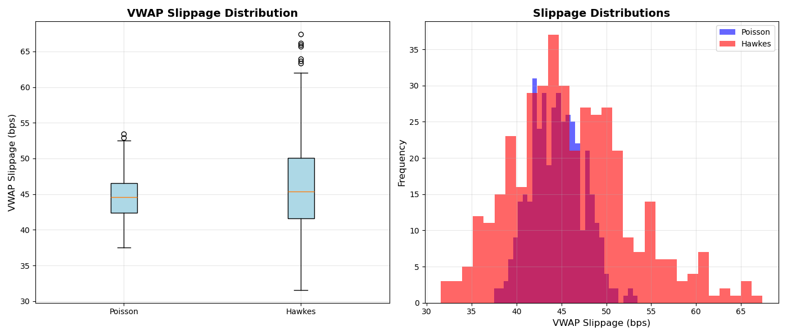

# Market-Microstructure-Simulator

Poisson vs Hawkes Order Flow and VWAP Execution Impact

Overview

This project studies how order arrival dynamics affect intraday price formation and execution costs in a simplified market microstructure setting.

Specifically, it compares:

Poisson order arrivals (memoryless, independent flow)

Hawkes order arrivals (self-exciting, clustered flow)

and evaluates their impact on:

Order flow clustering and price dynamics

VWAP execution cost and execution risk

The goal is not to build a predictive trading system, but to isolate and explain microstructure mechanisms in a controlled, interpretable environment.

Key Questions

1.How does clustered order flow differ from memoryless order flow?

2.Does clustering affect only price dynamics, or does it translate into real execution costs?

3.Is the impact primarily on average cost or execution risk and tail outcomes?

Methodology

1. Order Arrival Models

Poisson process with constant intensity (baseline)

Hawkes process with exponential kernel

Mean arrival rate matched to Poisson to isolate clustering effects

Self-excitation captures bursty, real-market-like order flow

2. Market Microstructure Model

Simplified Limit Order Book (LOB):

Discrete ask levels with finite depth

Liquidity depletion via market orders

Stochastic liquidity replenishment over time

Temporary price impact with mean reversion

This setup allows timing and clustering of orders to directly affect available liquidity and execution prices.

3. Execution Model

VWAP-style execution:

Total order size 𝑄

Participation rate 𝑝

Trades sliced proportionally over time

Execution cost measured as VWAP slippage (bps) relative to initial mid-price

4. Experimental Design

Monte Carlo simulations (400+ runs per scenario)

Identical execution parameters across Poisson and Hawkes cases

Statistical comparison of:

1.Mean and median VWAP slippage

2.Dispersion and tail behavior

3.Confidence intervals and hypothesis tests

Results Summary

Core Findings

1.Average execution cost under Hawkes arrivals is modestly higher than Poisson
(≈ +1–2 bps under realistic impact assumptions)

2.Execution risk is substantially higher under Hawkes arrivals:
~2× higher standard deviation

3.ignificantly fatter right tail of slippage outcomes

Results are statistically significant and robust across repeated simulations

VWAP Execution Cost Comparison

The following figure shows the distribution of VWAP slippage across Monte Carlo simulations
for Poisson and Hawkes order arrival processes.

Interpretation

When order flow is clustered, liquidity has fewer opportunities to recover between executions.
This amplifies temporary price impact and increases the likelihood of adverse execution outcomes.

In other words:

Clustering matters more for risk than for average cost
This aligns with how real execution desks think about slippage and tail risk

Dashboard

An interactive Streamlit dashboard visualizes the microstructure mechanisms:

-Order arrival patterns and inter-arrival times

-Autocorrelation and clustering statistics

-Trade-by-trade price formation

-Order imbalance dynamics

The dashboard focuses on mechanisms, while execution cost analysis is handled separately to maintain clarity.
👉 Live Dashboard: https://market-microstructure-simulator.streamlit.app/

Project Structure

Market-Microstructure-Simulator/
├── dashboard/        # Streamlit app (microstructure visualization)

├── execution/        # LOB and VWAP execution logic

├── simulations/      # Poisson and Hawkes processes

├── main.py           # VWAP execution experiments

├── requirements.txt

└── README.md

└── vwap_slippage

Limitations & Extensions

Limitations

-Stylized market with synthetic parameters

-No real-market calibration

-Simplified LOB and impact model

Possible Extensions

-Calibrate Hawkes parameters to real trade data

-Add alternative execution strategies (TWAP, adaptive participation)

-Study sensitivity across participation rates and liquidity regimes

Takeaway

This project demonstrates how order flow dynamics, independent of average activity levels, can materially affect execution risk through microstructure channels.
It highlights why clustering is a critical consideration in execution algorithms, even when average costs appear similar.